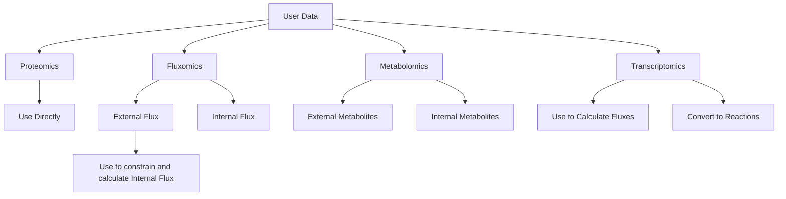

# Data Requirements

```mermaid
graph TD;
    A[User Data] --> B[Metabolomics];
    A --> C[Transcriptomics];
    A --> D[Fluxomics];
    A --> E[Proteomics];
    E --> F[Use Directly];
    D --> G[External Flux];
    D --> H[Internal Flux];
    B --> I[External Metabolites];
    B --> J[Internal Metabolites];
    C --> K[Use to Calculate Fluxes];
    C --> L[Convert to Reactions];
    G --> M[Use to constrain and calculate Internal Flux]
```
